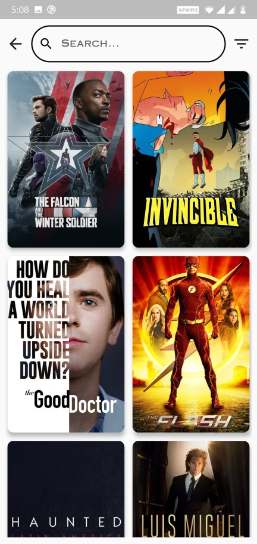
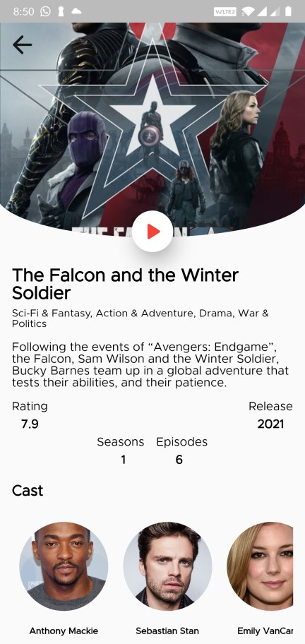

#Fun Box

Movies and Tv shows finder.

- Multi-module MVVM Clean Architecture
- Bloc Pattern
- GetIt and Injectable for dependency injection
- The Movie DB for movies and TV shows. [TheMovieDB](https://developers.themoviedb.org)

## Libraries Used
- [Bloc](https://pub.dev/packages/flutter_bloc)
- [GetIt](https://pub.dev/packages/get_it)
- [Injectable](https://pub.dev/packages/injectable)
- [YouTubePlayer](https://pub.dev/packages/youtube_player_flutter)
- [Http](https://pub.dev/packages/http)

## App Screens

- Home Screen

- Movies Sceen

- TV Shows Screen

- Movies Details

- TV Shows Details

- Cast Details

- Search movies & shows

- Filter movies & shows

